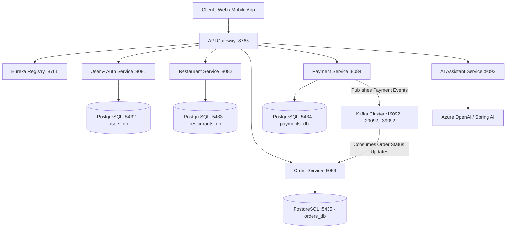

# IntelliDine 🍽️🤖

> **IntelliDine** is an enterprise-grade, AI-powered food ordering and restaurant management ecosystem built on a reactive microservices architecture using Java 21 LTS, Spring Boot 3.5.0, Spring Cloud, Apache Kafka, and Azure OpenAI / Spring AI.

---

## 📑 Table of Contents

- [Architecture Overview](#-architecture-overview)
- [Microservices Ecosystem](#-microservices-ecosystem)
- [Technology Stack](#-technology-stack)
- [Multi-Environment Configuration](#-multi-environment-configuration)
- [Prerequisites](#-prerequisites)
- [Getting Started & Local Setup](#-getting-started--local-setup)
  - [1. Configure Environment Variables](#1-configure-environment-variables)
  - [2. Start Infrastructure (Databases & Kafka)](#2-start-infrastructure-databases--kafka)
  - [3. Build & Run Microservices](#3-build--run-microservices)
- [Event-Driven Flow (Kafka)](#-event-driven-flow-kafka)
- [Database Migrations](#-database-migrations)
- [Security & Authentication](#-security--authentication)
- [Project Structure](#-project-structure)

---

## 🏛️ Architecture Overview



---

## 📦 Microservices Ecosystem

| Microservice | Port | Description | Database / Store |
|---|---|---|---|
| **`registry-service`** | `8761` | Netflix Eureka Service Discovery & Registry server. | In-memory |
| **`api-gateway`** | `8765` | Reactive Spring Cloud Gateway (WebFlux) routing requests to downstream services. | — |
| **`user-service`** | `8081` | Authentication & User Management (JWT with RSA asymmetric keys, RBAC). | PostgreSQL (`users_db` :5432) |
| **`restaurant-service`** | `8082` | Restaurant profiles, categories, menus, and item catalog management. | PostgreSQL (`restaurants_db` :5433) |
| **`order-service`** | `8083` | Order lifecycle, scheduling, state machines, and Kafka consumer. | PostgreSQL (`orders_db` :5435) |
| **`payment-service`** | `8084` | Payment processing, transaction ledger, and Kafka event publisher. | PostgreSQL (`payments_db` :5434) |
| **`ai-service`** | `9093` | AI-driven dietary suggestions, dynamic recommendations, and chatbot assistants. | Azure OpenAI (`gpt-4o-mini` / `gpt-4o`) |
| **`common-library`** | — | Shared cross-cutting components (`ApiResponse<T>`, `PageResponse<T>`, `ErrorResponse`, `GlobalExceptionHandler`). | — |

---

## 🛠️ Technology Stack

- **Core Framework**: Java 21 LTS, Spring Boot 3.5.0, Spring Cloud 2025.0.0
- **Service Discovery & Gateway**: Netflix Eureka, Spring Cloud Gateway (Reactive WebFlux)
- **Database & Persistence**: PostgreSQL 17 (Independent database per microservice), Spring Data JPA / Hibernate, Flyway Migrations
- **Event Streaming & Messaging**: Apache Kafka (3-broker Confluent cluster) with Zookeeper
- **AI Integration**: Spring AI, Azure OpenAI (GPT-4o / GPT-4o-mini)
- **Security**: OAuth2 Resource Server, JWT (Nimbus with RSA asymmetric key pairs)
- **Containerization**: Docker & Docker Compose

---

## 🌐 Multi-Environment Configuration

IntelliDine supports 4 distinct execution environments:

| Environment | Spring Profile | Target | Database Strategy | AI Model |
|---|---|---|---|---|
| **Local** | `local` | Local Machine / Docker | Local PostgreSQL instances (`5432-5435`), `show-sql: true` | `gpt-4o-mini` |
| **Development** | `dev` | Shared Dev Cloud | Dev DB cluster (`dev-postgres.intellidine.local`) | `gpt-4o-mini` |
| **Staging** | `stag` | Pre-production Staging Cluster | Staging DB cluster with SSL, `ddl-auto: validate` | `gpt-4o` |
| **Production** | `prod` | High-Availability Cluster | Prod HA cluster with SSL & HikariCP pooling (50 max connections) | `gpt-4o` |

Environment templates:
- `.env.example` — Master environment template
- `.env.local` — Local machine & Docker configurations
- `.env.dev` — Development environment variables
- `.env.stag` — Staging environment variables
- `.env.prod` — Production environment variables

---

## 📋 Prerequisites

Ensure you have the following installed on your machine:
- **Java 21 LTS** or later (`java -version`)
- **Maven 3.9+** (`mvn -version`)
- **Docker & Docker Compose** (`docker compose version`)
- **Git**

---

## 🚀 Getting Started & Local Setup

### 1. Configure Environment Variables

Copy `.env.example` to `.env.local` (or configure your shell environment):
```bash
cp .env.example .env.local
```

### 2. Start Infrastructure (Databases & Kafka)

From the project root, launch PostgreSQL instances and Kafka cluster:

```bash
# 1. Start PostgreSQL Databases (Ports: 5432, 5433, 5434, 5435)
docker-compose -f infrastructure/docker-compose-postgres.yml up -d

# 2. Start Zookeeper & Kafka 3-Broker Cluster
docker-compose -f infrastructure/kafka_cluster.yml up -d
```

### 3. Build & Run Microservices

Build all microservices and install `common-library`:
```bash
# Install common-library first
mvn -pl common-library clean install

# Build all microservices
mvn clean package -DskipTests
```

Start the services in the following order:

```bash
# 1. Service Registry (Eureka)
mvn -pl registry-service spring-boot:run

# 2. Core Business Services
mvn -pl user-service spring-boot:run
mvn -pl restaurant-service spring-boot:run
mvn -pl payment-service spring-boot:run
mvn -pl order-service spring-boot:run
mvn -pl ai-service spring-boot:run

# 3. API Gateway
mvn -pl api-gateway spring-boot:run
```

> **Tip:** By default, services run under the `local` profile. To run with another profile, pass `-Dspring-boot.run.profiles=<profile>` (e.g., `-Dspring-boot.run.profiles=dev`).

---

## 🔄 Event-Driven Flow (Kafka)

1. A customer places an order via the `order-service`.
2. The payment transaction is initiated via `payment-service`.
3. Upon payment completion/failure, `payment-service` publishes payment event messages to Kafka topic: `payment-events`.
4. `order-service` consumes events via `OrderServiceKafkaListener` and transitions the order status (`CONFIRMED`, `FAILED`, `CANCELLED`).
5. `OrderStatusSchedulerProcessing` schedules periodic checks to reconcile lingering orders.

---

## 🗄️ Database Migrations

Each microservice manages its own schema independently using **Flyway**:
- `user-service`: `db/migration/V1__create_roles_table.sql`, `V2__create_users_table.sql`, `V3__add_create_at_column.sql`
- `restaurant-service`: `db/migration/V1__create_restaurants_and_restaurantmenus_table.sql`

Migrations run automatically upon application startup.

---

## 🔐 Security & Authentication

- Asymmetric RSA Public/Private Key authentication via Spring Security and Nimbus JOSE.
- Public/Private keys are located under `user-service/src/main/resources/certs/` or configured via `RSA_PRIVATE_KEY` / `RSA_PUBLIC_KEY` environment variables.
- Passwords are encrypted using BCrypt.

---

## 📂 Project Structure

```
IntelliDine/
├── ai-service/              # Spring AI & Azure OpenAI integrations
├── api-gateway/             # Spring Cloud Gateway (Reverse proxy & routing)
├── common-library/          # Shared DTOs, responses, and exception handlers
├── infrastructure/          # Docker compose files for Postgres & Kafka
├── order-service/           # Order placement, status tracking & schedulers
├── payment-service/         # Payment processing & Kafka event publisher
├── registry-service/        # Netflix Eureka Service Discovery server
├── restaurant-service/      # Restaurants & Menu catalog management
├── user-service/            # Authentication, JWT, and User management
├── .env.example             # Environment variables template
├── .gitignore               # Git ignore configuration
└── README.md                # Project documentation
```

---

## 📄 License

This project is licensed under the MIT License.
